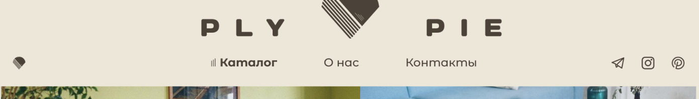

# PlyPie

 

[//]: # (## contents)

[//]: # ()
[//]: # (- [registration and authorization]&#40;#registration-and-authorization&#41;)

[//]: # (- [about this project]&#40;#about-this-project&#41;)

[//]: # (- [what I learned doing this project]&#40;#what-I-learned-doing-this-project&#41;)

[//]: # (    - [localStorage and sessionStorage]&#40;#localStorage-and-sessionStorage&#41;)

[//]: # (    - [authentication and authorization]&#40;#authentication-and-authorization&#41;)

[//]: # (    - [HOC and wrapping in other components]&#40;#HOC-and-wrapping-in-other-components&#41;)

## about this project

This is my pet-project for a very cool handmade retro futuristic furniture store. I realize that using `React` for this kind of website is an overkill and any CMS would be more than enough. This is still a training project for me with a practical use for the seller - PlyPie. Thanks to the owner for this opportunity ❤

The guy is doing really cool stuff from ply wood. Check it out!